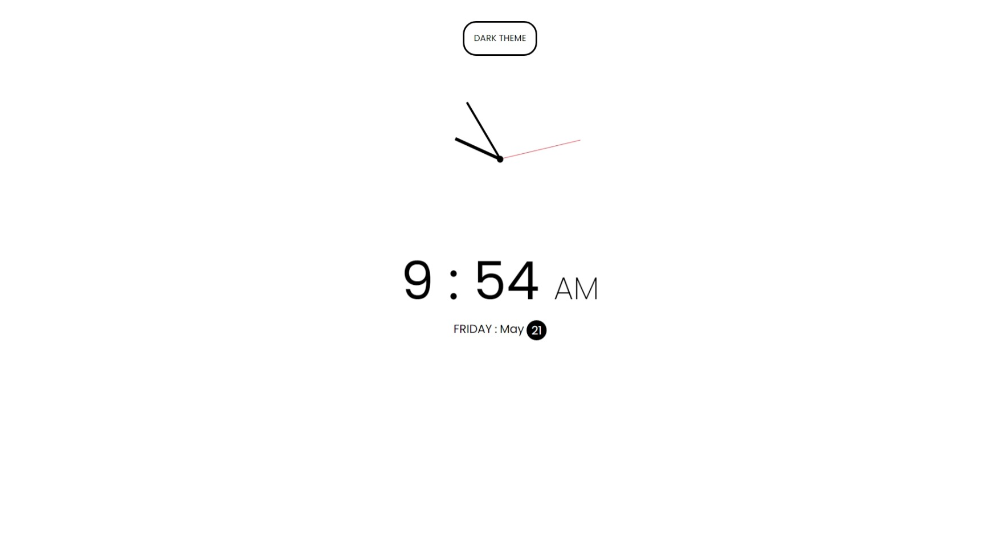
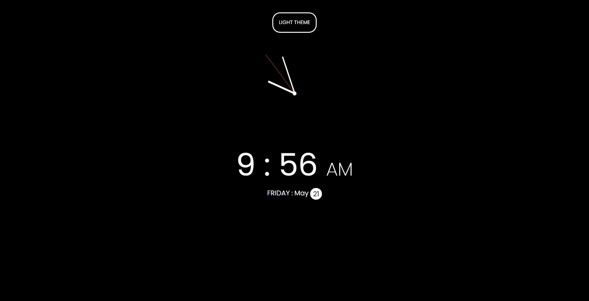

## CSS

- About theme change, just use CSS variable. I mean `var()` not the $ of Sass, because CSS variable not translate to hard code, it just `var` for itself

- Set var in the `:root`

```css
:root {
  --primary: black;
  --second: white;
}
```

- After that combine body with some class and change the value of css variable

```css
body.dark {
  --primary: white;
  --second: black;
}
```

### JavaScript

- Hour (from 0 to 11), minute and second (0 to 59) take that and use scale function to map that range of number to circle degree (0 to 360) that way we can make the tick point to exact ratio

- scale function

```javascript
function scaleRange(number, inMin, inMax, outMin, outMax) {
  return ((number - inMin) * (outMax - outMin)) / (inMax - inMin) + outMin;
}
```

## Screenshot

#### Light Theme



#### Dark Theme



## Live Site

URL: [Link]()
